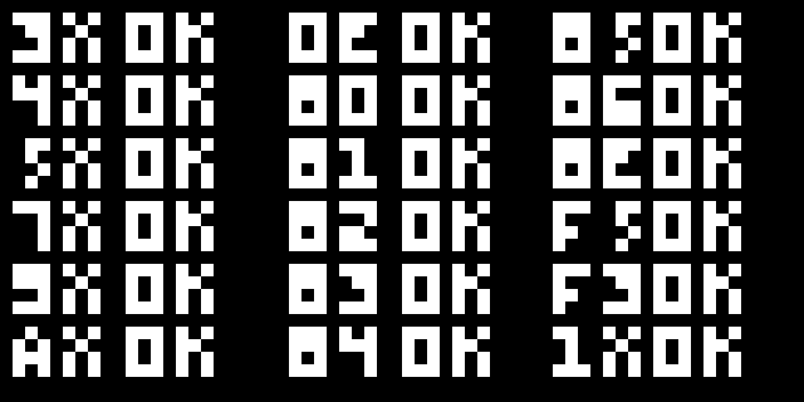

# CHIP-8 Emulator

A CHIP-8 emulator written in Zig with Raylib.



All CHIP-8 instructions handled, sound is also working! :)

## Build and Run

```bash
zig build run
```

## Controls

```
1 2 3 C    →    1 2 3 4
Q W E R    →    Q W E R  
A S D F    →    A S D F
Z X C V    →    Z X C V
```

The CHIP-8 keypad is mapped to QWERTY keys as shown above.
